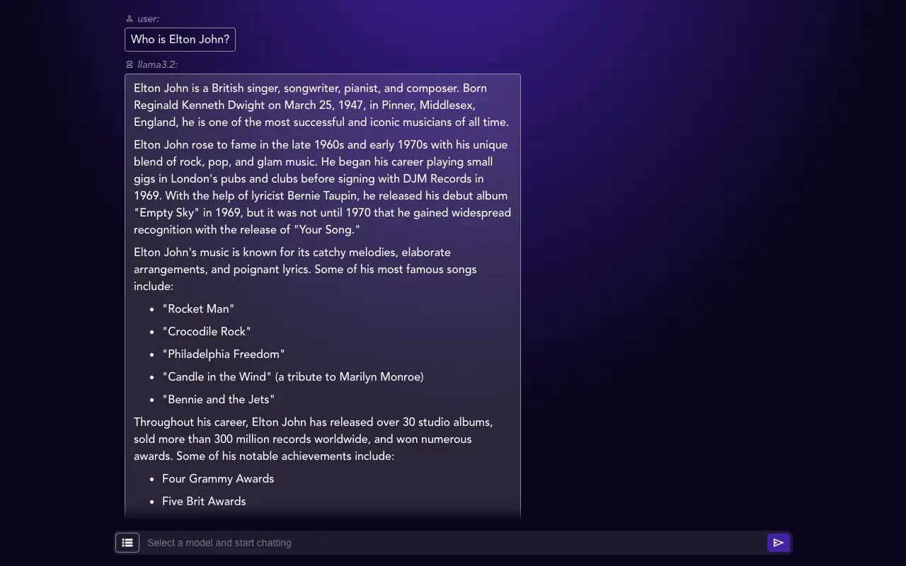

# OllamaFrontend
A dead simple frontend for Ollama served with `Bun`




#### Requirements

- Bun
- Ollama
- At least 1 local model 


To install dependencies:

```bash
bun i
```

To run:

```bash
bun run start
```


#### ToDo

- ~~Handle Streaming data output~~
- ~~Format markdown output~~
- Make it easy to manage models in GUI
- Convert this whole thing to a Tauri App IDK